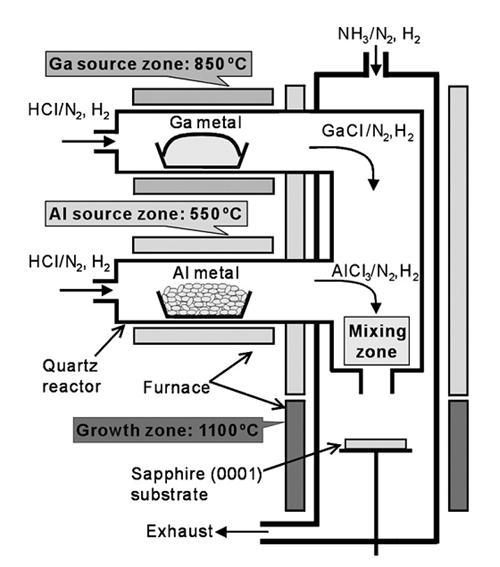
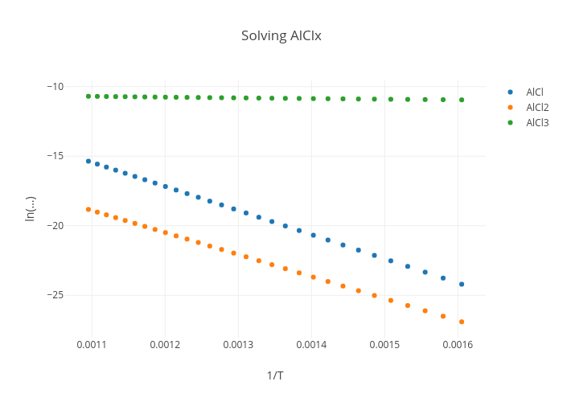
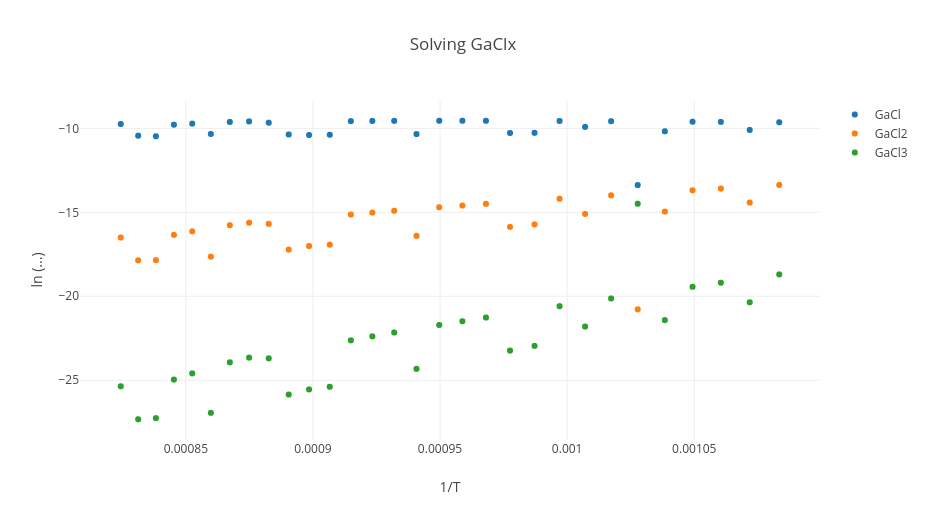
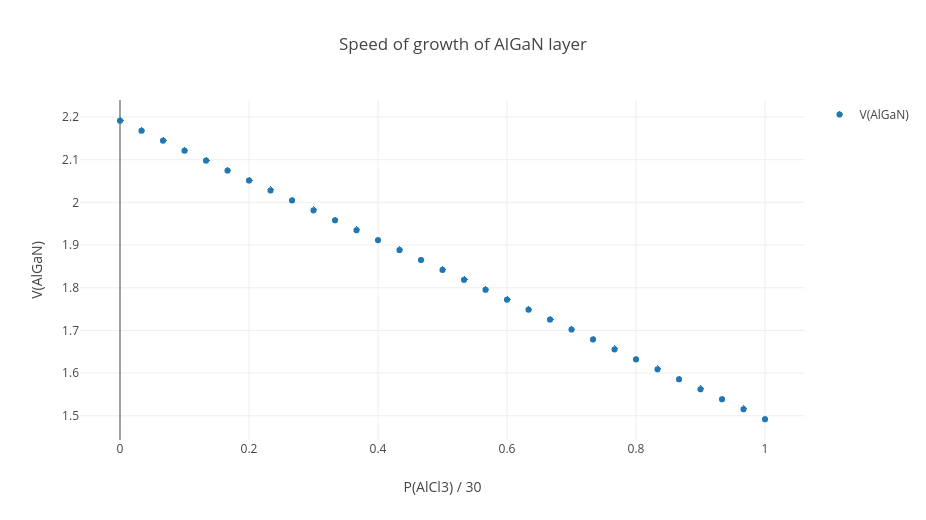
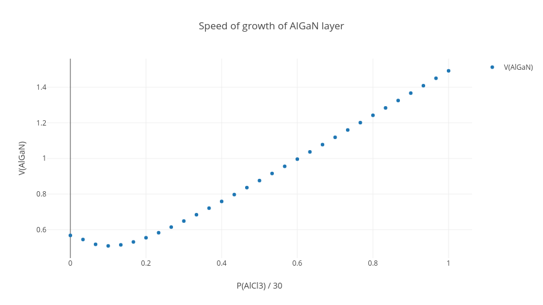

# Отчёт по курсовой работе

### Проект по курсу "Численные методы"
#### Моделирование роста монокристаллического твердого раствора AlxGa1-xN методом хлоридной эпитаксии

Работу выполнили студенты 3 курса КТ:
- Плотников Андрей  (М3337)
- Жучкова Анастасия (М3336)
- Макаренко Егор    (М3337)
- Фисков Роман      (М3336)

Преподаватель:
- Сегаль А. С.

### Введение

Алган (AlxGa1-xN) – полупроводниковый материал, 
твердый раствор нитрида алюминия (AlN) и нитрида галлия (GaN), 
который используется в производстве оптоэлектронных приборов, 
в том числе светодиодов, работающих в глубоко ультрафиолетовом диапазоне, 
и полупроводниковых лазеров.

Технологический процесс хлоридной эпитаксии состоит из двух процессов:
1. На источники, содержащие твердый алюминий и жидкий галлий подается хлороводород HCl. 
В результате химических реакций образуются газообразные хлориды 
алюминия (AlCl, AlCl2, AlCl3) и галлия (GaCl, GaCl2, GaCl3).
2. Во втором процессе все газы смешиваются и подаются в реактор при температуре 1100°C, 
где располагается монокристаллическая подложка. 
На этой подложке в результате химических реакций происходит рост алгана.

Наглядно весь процесс представлен на схеме:

### Метод решения систем нелинейных уравнений

При решении последующих задач необходимо будет решать системы нелинейных уравнений (СНУ).
Есть несколько способов решения, и мы выбрали _«Универсальный» метод_, 
который комбинирует в себе два других метода: _Метод градиентного спуска_ и _Метод Ньютона_.

1. Выбирается произвольный начальный вектор `res`
2. Каждую итерацию выполняется метод градиентного спуска:
   1. Находится градиент каждого уравнения системы в точке `х`: 
      
      **G = ∇S |x = res**, следующим образом:
      
      1. Вычисление значения функций в точке `х`: 
         
         **Vi = -Si (x) |x = res for i = 1..n**
         
      2. Вычисление матрицы Якоби в точке `х`:
         
         **J = [∇Si |x = res] for i = 1..n**
         
      3. Решение линейной системы методом Гаусса:
         
         **G = gauss (J, V)**
   2. Находится локальный минимум системы в точке `х` и с градиентом `G`:
      
   3. Смещение результата на значение локального минимума **res = min * G**
3. Если не достигнута необходимая точность, то повторить пункт 2.

### Решение задачи о конверсии хлороводорода (HCl) в хлориды алюминия (AlCln)

Процессы, происходящие в источнике алюминия описываются реакциями:

(R1) **2Alsolid + 2HCl ↔ 2AlCl + H2**

(R2) **Alsolid + 2HCl ↔ AlCl2 + H2**

(R3) **2Alsolid + 6HCl ↔ 2AlCl3 + 3H2**

В следствии чего, возникают требования: 
* найти термодинамические давления компонентов: AlCl, AlCl2, AlCl3, HCl, H2
* найти межфазные потоки Al-содержащих покомпонет: AlCl, AlCl2, AlCl3
* найти скорость испарения источника алюминия
* построить графики зависимостей

Решение этой задачи приводится в файле [**ru.shemplo.kse.course.task.TaskSolveAlClx**](src/main/java/ru/shemplo/kse/course/task/TaskSolveAlClx.java)

На каждом шаге для температур `T = 350..650℃` с шагом `dT = 10℃` 
производится решение СНУ, составленной из _условий приближённого термодинмического равновесия_ 
и _условий "невхождения" элементов H и Cl_.

Это решение даёт требуемые термодинамические давления, 
а с помощью формулы 

(1) **Gi = Di * (Pgi - Pei) / RTδ**

находятся межфазные потоки активных компонент. 
Далее по формуле 

(7) **VAl = (GAlCl + GAlCl2 + GAlCl3) (μAl / ρAl) * 109** 

находится скорость испарения алюминиевого источника.

Результаты запусков (значения **G' = ln (|Gi|)**) 
для каждого компонента записываются в отдельный файл в формате: 

**T-1dT ; G'**

Тогда, для **GAlCl**, **GAlCl2** и **GAlCl3** 
диаргаммы Аррениуса будут выглядеть:

Из чего можно делать вывод, что преобладающим Al-содержащим компонентом является **AlCl3**

### Решение задачи о конверсии хлороводорода (HCl) в хлориды галия (GaCln)

Процессы, происходщие в источнике алюминия описываются реакциями:

(R4) **2Galiquid + 2HCl ↔ 2GaCl + H2** 

(R5) **Galiquid + 2HCl ↔ GaCl2 + H2**

(R6)**2Galiquid + 6HCl ↔ 2GaCl3 + 3H2**

В следствии чего, возникают требования: 
* найти термодинамические давления компонентов: GaCl, GaCl2, GaCl3, HCl, H2
* найти межфазные потоки Ga-содержащих покомпонет: GaCl, GaCl2, GaCl3
* найти скорость испарения источника галия
* построить графики зависимостей

Решение этой задачи приводится в файле [**ru.shemplo.kse.course.task.TaskSolveGaClx**](src/main/java/ru/shemplo/kse/course/task/TaskSolveGaClx.java)

На каждом шаге для температур `T = 650..950℃` с шагом `dT = 10℃` 
производится решение СНУ, составленной из _условий приближённого термодинмического равновесия_ 
и _условий "невхождения" элементов H и Cl_.

Это решение даёт требуемые термодинамические давления, 
а с помощью формулы (1) находятся межфазные потоки активных компонент. 
Далее по формуле (7) находится скорость испарения галиевого источника.

Результаты запусков (значения **G' = ln (|Gi|)**) 
для каждого компонента записываются в отдельный файл в формате: 

**T-1dT ; G'**

Тогда, для **GGaCl**, **GGaCl2** и **GGaCl3** 
диаграммы Аррениуса будут выглядеть:

Из чего можно делать вывод, что преобладающим Ga-содержащим компонентом является **GaCl**

### Моделирование роста твердого раствора algan (AlxGa1-xN)

В предыдущих двух задачах было показано, что преобладающими Al- и Ga-содержащими компонентами 
растущего алгана являются **AlCl3** и **GaCl**. 
Тогда рост алгана в основном происходит в результате «производящих» реакций:

(R7) **AlCl3 + NH3 ↔ AlNsolid + 3HCl**

(R8) **GaCl + NH3 ↔ GaNsolid + HCl + H2**.

В следствии чего, возникают требования:
* найти термодинамические давления компонентов: AlCl3, GaCl, NH3, HCl, H2
* найти межфазные потоки компонентов: AlCl3, GaCl
* найти скорость роста слоя VAlGaNg
* долю AlN-составляющей в твёрдом растворе х в завсимости от доли AlCl3

Решение этой задачи разбивается на 2 случая: 
_несущий газ - N2_ и _несущий газ - смесь N2 + H2_

По условию на давления газов N2 и H2 накладываются ограничения 
**PH2g + PN2g = 98470 Па**, 
но т.к. в первом случае **PH2g = 0 Па**, 
то тогда **PN2g = 98470 Па**. 
Кроме того, моделирование происходит при температуре `T = 1100℃`.

Решение обоих случаев приводится в файле [**ru.shemplo.kse.course.task.TaskSolveAlGaN**](src/main/java/ru/shemplo/kse/course/task/TaskSolveAlGaN.java) 
с той лишь разницей, что запускается он при разных входных условиях давления.

В результате решения НСУ мы получаем термодинамические давления и долю AlN-составляющей.
С помощью формулы (1) находятся межфазные потоки активных компонент, и с помощью формулы

(20) **VAlGaNg = \[GAlCl3(μAlN / ρAlN) + GGaCl(μGaN / ρGaN)\] * 109**

находится скорость роста слоя алгана.

В первом случае, график скорости роста слоя алгана будет выглядеть 
(график скорости роста слоя **VAlGaNg**, 
в зависимости от давления **PAlCl3**):

Во втором случае давления N2 и H2 будут иметь соотношение 
**PH2g / PN2g = 1 / 9**, 

откуда 
**PH2g = 9847 Па** и **PN2g = 88623 Па**,
а график роста слоя алгана примет вид:

Эффект, наблюдаемый при добавлении H2, объясняется тем, что:
* При отсутствии H2 молярная доля AlN в сплаве определяется потоком AlCl3, 
который линейно зависит от его парциального давления, так как AlCl3 недостаточен.
* Малое количество H2 резко замедляет реакцию (R8), которая вносит
наибольший вклад в производство Ga в сплаве, но никаким образом не влияет на реакцию
(R7), которая в свою очередь отвечает за включение Al в сплав.
